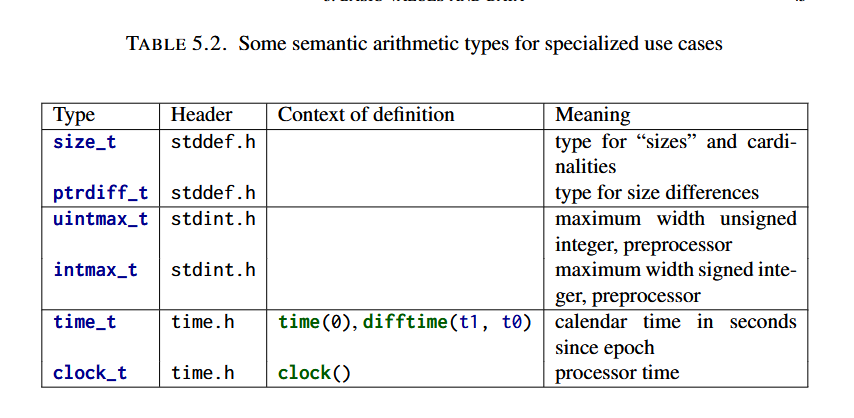

## encounter

### 1 getting started

- compilers don't agree on what are errors and what are warnings.
  - with GCC, the command-line option `Werror` forces it to reject programs with warnings.

### 2 the principal structure of a program

- there are two aspects to any C program
  - syntactic
    - how to get the compiler to understand code we write
  - semantic
    - how to ensure the program does what we intend
    - further broken down into
      - declarations
        - the compiler has to know about an identifier before it can be used---identifiers need to be *declared*.
        - identifiers need not have just one declaration but there can't be more than one in the same *scope*.
      - definitions
        - provide the particular value of an object and where it can be found.
      - statements
- identifiers in C can be
  - data objects
  - type aliases
  - functions 
  - constants
- attributes (such as `[[maybe_unused]]`) are new in C23 and provide "supplemental information to the principle structure of the program."
- important properties of variables
  - type
  - object
  - value
  - identifier

#### questions

- what exactly differentiates objects from functions and why?

## acquaintance

### buckle up

> the most dangerous constructs in C are the so-called **casts**.

- the digit separator in C (starting with C23) is ' e.g. `10000 = 10'000`

### 3 everything is about control

#### challenge 1

- task is to implement merge sort and quick sort as well as a test routine.

### 4 expressing computations

- the library `stdint.h` includes the constant `SIZE_MAX` which is the maximum value that can be stored in a `size_t`

### 5 basic values and numbers

- all values are numbers or translate to numbers

We don’t want the result of a computation to
depend on the executable (which is platform specific) but ideally to depend only on the
program specification itself. An important step to achieve this platform independence is
the concept of type

C only imposes properties on representations such that the
results of operations can be deduced a priori from two different sources:
• The values of the operands
• Some characteristic values that describe the particular platform
For example, the operations on the type size_t can be entirely determined when inspecting
the value of SIZE_MAX in addition to the operands. We call the model to represent values
of a given type on a given platform the binary representationC of the type.

remember that for any arithmetic or comparison, the narrow unsigned types are pro-
moted to signed int and not to unsigned int, as this diagram might suggest

pointers are valid null or indeterminate