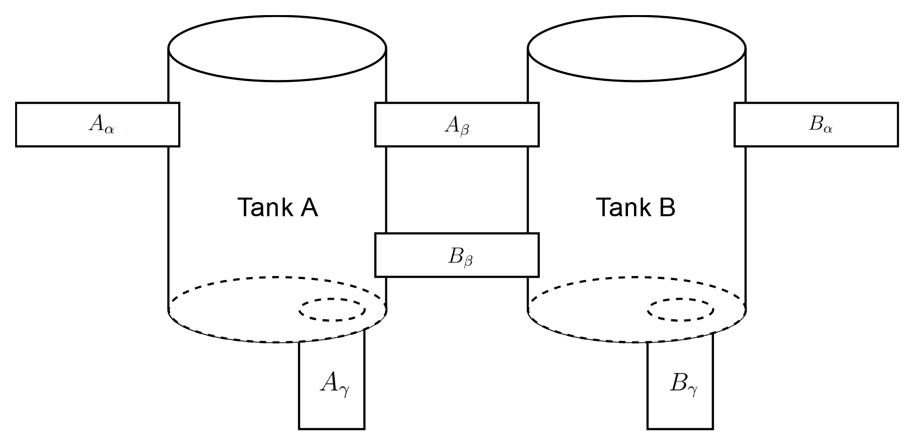
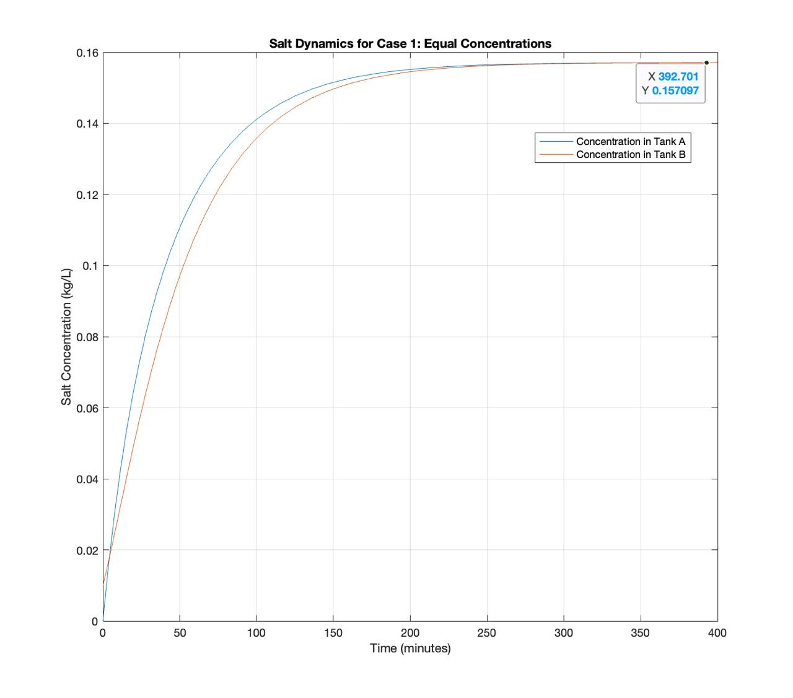
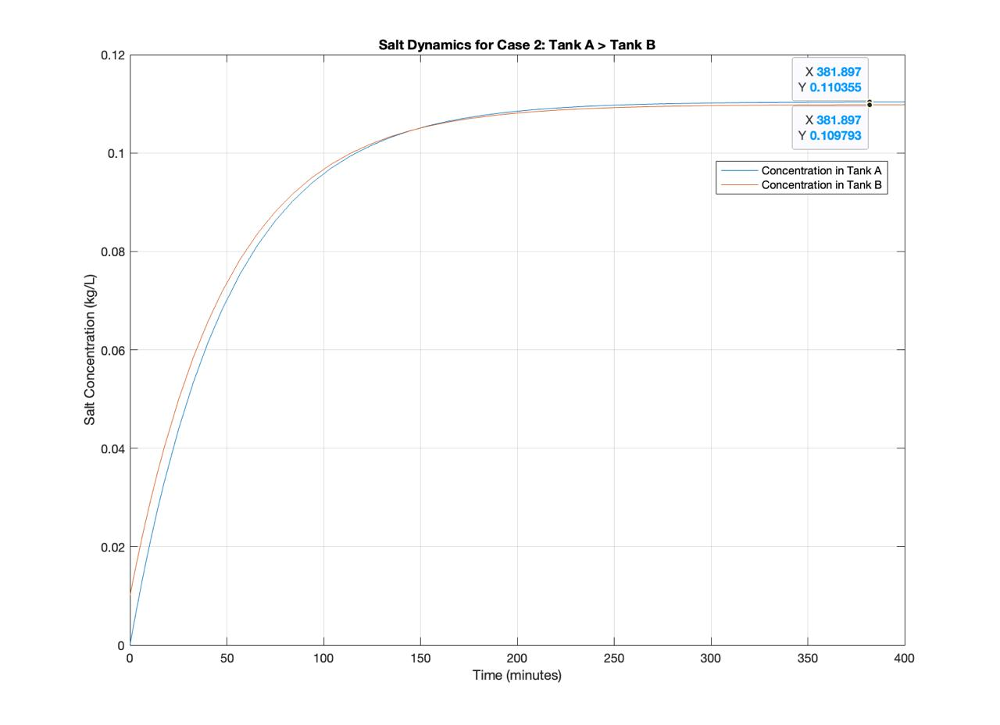

$\pagebreak$

# List of Symbols


# Introduction

We propose a solution to a classic two-tank mixing liquids problem. The liquids in this case are saline and pure water. The system consists of two 100 L interconnected tanks which are referred to as Tank A and Tank B. $\autoref{fig:sys_illus}$ illustrates the setup of the tanks and connections between them and an external system that feeds and drains saltwater from both tanks

{#fig:sys_illus width=75%}

Each tank has four pipes connected to it. For Tank A, the pipe labelled as $A_\alpha$ delivers water with a salt concentration of $K_A$ at a rate of $V_{A+}$. The two pipes labelled $A_\beta$ and $A_\gamma$ drain water from Tank A into Tank B at a rate of $V_{AB}$ and into the external environment at $V_{A-}$ respectively. Finally, the pipe $B_\beta$ delivers salt water from Tank B to Tank A at a rate of $V_{BA}$. The setup is the same for Tank B only that the symbols $A$ and $B$ are interchanged in the parameters of Tank A to get those of Tank B. $\autoref{tab:flow_params}$ summarizes inflow and outflow parameters for both tanks.

|        |              Inflow               |       Outflow       | Initial salt mass |
| ------ | :-------------------------------: | :-----------------: | :---------------: |
| Tank A | $V_{A+}$ ($K_A$ conc.),  $V_{BA}$ | $V_{A-}$,  $V_{AB}$ |       0 kg        |
| Tank B | $V_{B+}$ ($K_B$ conc.),  $V_{AB}$ | $V_{B-}$,  $V_{BA}$ |       1 kg        |
Table: Flow parameters and initial salt contents of both tanks. $\label{tab:flow_params}$

At time $t=0$, the initial salt concentrations in each tank are known, and the system evolves dynamically according to the flow rates and concentrations. The objective is to determine the steady-state salt concentrations in each tank, as well as to analyze how the system evolves under various parameter choices.

# Model

We base our model chiefly on the principle of conservation of mass. That is, the rate of change of salt in each tank is equal to the difference between the rate at which salt enters the tank and the rate at which it leaves.

Let $S_A(t)$ and $S_B(t)$ represent the salt concentrations in Tanks A and B respectively at time $t$. The total mass of salt in each tank at any time is given by the product of the concentration and the tank volume. This follows from the constraint that the volumes in the tanks remain constant, which can be ensured by choosing the right values for the flow rate parameters. Also, we know from dimensional analysis that the rate at which salt enters or leaves a tank is the product of the flow rate and the concentration.

## Tank A Equation

Each of the four pipes connected to Tank A contribute a term to its differential equation. We designate inflows as positive terms and outflows as negative. $A_\alpha$ and $B_\beta$ are inflow pipes while $A_\beta$ and $A_\gamma$ are outflow pipes. If we use the names of the pipes to represent their salt throughputs, the rate of change of salt in Tank A is

\begin{align}
  \frac{dS_A(t)}{dt} &= A_\alpha + B_\beta - (A_\beta + A_\gamma). \label{eq:a_pipe}
\end{align}

$\autoref{eq:a_pipe}$ can be written in terms of the flow rates and concentrations of the liquids in the pipes as

\begin{align}
  \frac{dS_A(t)}{dt} &= V_{A+} K_A + V_{BA}\frac{S_B(t)}{100\,\text{L}} - \left(V_{AB}\frac{S_A(t)}{100\,\text{L}} + V_{A-}\frac{S_A(t)}{100\,\text{L}}\right). \label{eq:a_diff}
\end{align}

This gives the first half of a system of differential equations whose solution can be used to predict the salt concentrations of both tanks over time. 

## Tank B Equation

We perform the same analysis for Tank B as for Tank A, yielding the following differential equation in terms of the salt throughputs of the pipes connected to it:

\begin{align}
  \frac{dS_A(t)}{dt} &= B_\alpha + A_\beta - (B_\beta + B_\gamma). \label{eq:b_pipe}
\end{align}

Hence, the differential equation for Tank B is

\begin{align}
  \frac{dS_B(t)}{dt} &= V_{B+} K_B + V_{AB}\frac{S_A(t)}{100\,\text{L}} - \left(V_{BA}\frac{S_B(t)}{100\,\text{L}} + V_{B-}\frac{S_B(t)}{100\,\text{L}}\right). \label{eq:b_diff}
\end{align}

$\autoref{eq:b_diff}$ is the other half of the system of ODEs that model the given problem.

## Assumptions

The equations derived in the preceding sections rely on simplifying assumptions about the system which are outlined below.

1. The salt concentration in a tank at any moment in time is the same throughout its volume.
2. The volumes in each tank remain constant at 100 L. We achieve this by making the sum of inflow rates for each tank equal the sum of outflow rates, which is expressed as
  \begin{align}
    V_{A+} + V_{BA} &= V_{A-} + V_{AB},\,\text{and} \\
    V_{B+} + V_{AB} &= V_{B-} + V_{BA},
  \end{align}
  which reduce simply to
  \begin{align}
    V_{A+} + V_{B+} &= V_{A-} + V_{B-} \label{eq:cons}
  \end{align}

These assumptions simplify the system's dynamics, removing the need to account for spatial variations or changing volumes.

# Solutions

Since our model is a system of two linear ordinary differential equations, an analytical solution is feasible. We begin by solving the system analytically for choice values of the parameters. Next, we provide a numerical solution for the same set of parameters.

## Analytical solution

We start by considering the steady state situation. Let $t_s$ be the time at which the system reaches its equilibrium. Also, let

\begin{align*}
  S_{A_{\text{std}}} &= S_A(t_s) & c_{A_{\text{std}}} &= \frac{S_{A_{\text{std}}}}{100} \\
  S_{B_{\text{std}}} &= S_B(t_s) & c_{B_{\text{std}}} &= \frac{S_{B_{\text{std}}}}{100}
\end{align*}

be the masses and concentrations of salt in Tank A and Tank B respectively when $t=t_s$. At equilibrium, the rates of change of salt in both tanks are zero. That is, for Tank A,

\begin{align}
  && \frac{dS_A(t)}{dt} &= 0 \\
  &\Rightarrow& V_{A+} K_A + V_{BA}\frac{S_{B_{\text{std}}}}{100\,\text{L}} - \left(V_{AB}\frac{S_{A_{\text{std}}}}{100\,\text{L}} + V_{A-}\frac{S_{A_{\text{std}}}}{100\,\text{L}}\right) &= 0 \\
  &\Rightarrow& (100\,\text{L})V_{A+} K_A &= (V_{AB} + V_{A-})S_{A_{\text{std}}} - V_{BA}S_{B_{\text{std}}}. \label{eq:a_equi}
\end{align}

The steady-state equation for Tank B can be derived in a similar manner as

\begin{align}
  (100\,\text{L})V_{B+} K_B &= - V_{AB}S_{A_{\text{std}}} + (V_{BA} + V_{B-})S_{B_{\text{std}}}. \label{eq:b_equi}
\end{align}

$\autoref{eq:a_equi}$ and $\autoref{eq:b_equi}$ form a system of two linear equations which can be solved for $S_{A_{\text{std}}}$ and $S_{B_{\text{std}}}$ simultaneously. We employ the use of matrices to simplify the problem by setting

\begin{align*}
  A &= \begin{bmatrix}
        V_{AB} + V_{A-} & -V_{BA} \\
        -V_{AB} & V_{BA} + V_{B-}
       \end{bmatrix}, \\
  \symbfit{x} &= \begin{bmatrix}
              S_{A_{\text{std}}} \\
              S_{B_{\text{std}}}
            \end{bmatrix},\,\text{and} \\
  \symbfit{b} &= \begin{bmatrix}
              (100\,\text{L})V_{A+} K_A \\
              (100\,\text{L})V_{B+} K_B
            \end{bmatrix}.
\end{align*}

It follows that

\begin{align}
  &&A\symbfit{x} &= \symbfit{b} \\
  &\Rightarrow& \symbfit{x} &= A^{-1}\symbfit{x} \\
  &\Rightarrow& \begin{bmatrix}
              S_{A_{\text{std}}} \\
              S_{B_{\text{std}}}
            \end{bmatrix}                  &= \begin{bmatrix}
                          \dfrac{100(K_AV_{A+}(V_{BA}+V_{B-}) + K_BV_{BA}V_{B+})}{V_{A-}V_{BA} + V_{AB}V_{B-} + V_{A-}V_{B-}} \\[0.5cm]
                          \dfrac{100(K_BV_{B+}(V_{AB}+V_{A-}) + K_AV_{AB}V_{A+})}{V_{A-}V_{BA} + V_{AB}V_{B-} + V_{A-}V_{B-}}
                        \end{bmatrix} \\
                        &&&= \begin{bmatrix}
                          \dfrac{100(K_AV_{A+}(V_{BA}+V_{B-}) + K_BV_{BA}V_{B+})}{D} \\[0.5cm]
                          \dfrac{100(K_BV_{B+}(V_{AB}+V_{A-}) + K_AV_{AB}V_{A+})}{D}
                        \end{bmatrix} \\
   &\Rightarrow& \begin{bmatrix}
              c_{A_{\text{std}}} \\
              c_{B_{\text{std}}}
            \end{bmatrix} &= \begin{bmatrix}
                          \dfrac{K_AV_{A+}(V_{BA}+V_{B-}) + K_BV_{BA}V_{B+}}{D} \\[0.5cm]
                          \dfrac{K_BV_{B+}(V_{AB}+V_{A-}) + K_AV_{AB}V_{A+}}{D}
                        \end{bmatrix}, \\
\end{align}

where

\begin{align}
  D = V_{A-}V_{BA} + V_{AB}V_{B-} + V_{A-}V_{B-}.
\end{align}

We consider two possible cases at equilibrium:

1. The two tanks contain the same quantity of salt. That is
   \begin{align}
      &&c_{A_{\text{std}}} &= c_{B_{\text{std}}} \\
      &\Rightarrow& K_AV_{A+}(V_{BA}+V_{B-}) + K_BV_{BA}V_{B+} &= K_BV_{B+}(V_{AB}+V_{A-}) + K_AV_{AB}V_{A+} \\
      &\Rightarrow& K_AV_{A+}(V_{BA}+V_{B-}) - K_AV_{AB}V_{A+} &= K_BV_{B+}(V_{AB}+V_{A-}) - K_BV_{BA}V_{B+} \\
      &\Rightarrow& K_AV_{A+}(V_{BA} + V_{B-} - V_{AB}) &= K_BV_{B+}(V_{AB} + V_{A-} - V_{BA}) \\
      &\Rightarrow& \frac{K_AV_{A+}}{K_BV_{B+}} &= \frac{V_{AB} + V_{A-} - V_{BA}}{V_{BA} + V_{B-} - V_{AB}}. \label{eq:relation_eq}
    \end{align}
2. Tank A contains more salt than Tank B. From $\autoref{eq:relation_eq}$, this implies
    \begin{align}
      \frac{K_AV_{A+}}{K_BV_{B+}} &> \frac{V_{AB} + V_{A-} - V_{BA}}{V_{BA} + V_{B-} - V_{AB}}. \label{eq:relation_gt}
    \end{align}

We find parameters that satisfy each relation defined above as well as $\autoref{eq:cons}$ by creating one comparator for each relation and calling the `find_params()` function defined in $\ref{sec:search_func}$. The code listing below shows how this is done.

```matlab
gt_comp = @(a,b) a > b;
eq_comp = @(a,b) a = b;

gt_params = find_params(gt_comp);
eq_params = find_params(eq_comp);
```

$\autoref{tab:src_params}$ shows the result of running the above code block.

|                  | $=$  | $>$  |
| :--------------- | ---- | ---- |
| $V_{A+}$ (L/min) | 2.00 | 2.00 |
| $V_{A-}$ (L/min) | 2.10 | 2.05 |
| $V_{B+}$ (L/min) | 2.20 | 2.05 |
| $V_{B-}$ (L/min) | 2.10 | 2.00 |
| $V_{AB}$ (L/min) | 2.80 | 2.00 |
| $V_{BA}$ (L/min) | 2.10 | 2.25 |
| $K_A$ (kg/L)     | 0.22 | 0.10 |
| $K_B$ (kg/L)     | 0.10 | 0.12 |
Table: Parameter values that satisfy the two cases. $\label{tab:src_params}$

Let $M=-\dfrac{1}{100}A$ and 
\begin{equation}
  \symbfit{S}(t) = \begin{bmatrix}
                  S_A(t) \\ S_B(t)
                \end{bmatrix}.
\end{equation}

Consequently,

\begin{align}
  \frac{d}{dt} \symbfit{S}(t) = M \symbfit{S}(t) + \frac{1}{100}\symbfit{b},
\end{align}

which is solved by

\begin{align}
  \symbfit{S}(t) = c_1e^{\lambda_1t}\symbfit{v}_1 + c_2e^{\lambda_2t}\symbfit{v}_2 + \symbfit{x}. \label{eq:trans}
\end{align}

$c_1$ and $c_2$ are constants that can be determined from the initial conditions of the system, while $\lambda_1$ and $\lambda_2$ are the 
eigenvalues of $M$, with corresponding eigenvectors $\symbfit{v}_1$ and $\symbfit{v}_2$ respectively. Lastly, $\symbfit{x}$ is the vector of steady-state
salt quantities from earlier.

### A solution with equal concentrations {#sec:eq_conc}

From the choice of parameters in $\autoref{tab:src_params}$, the coefficient matrix when $c_{A_{\text{std}}} = c_{B_{\text{std}}}$ is

\begin{equation}
  M = \frac{1}{100}\begin{bmatrix}
        -4.90 & 2.10\\ 2.80 & -4.20
      \end{bmatrix},
\end{equation}

having the following eigenvalues and eigenvectors.

\begin{align*}
  \lambda_1 &= -0.070 & \symbfit{v}_1 &= \frac{1}{\sqrt{2}}\begin{bmatrix} -1 \\ 1 \end{bmatrix} \\
  \lambda_2 &= -0.021 & \symbfit{v}_2 &= \begin{bmatrix} -0.60 \\ -0.80 \end{bmatrix}
\end{align*}

The steady-state solution for these parameters is

\begin{equation}
  \symbfit{x} = \begin{bmatrix}
                  S_{A_{\text{std}}} \\
                  S_{B_{\text{std}}}
                \end{bmatrix} = \frac{110}{7}\begin{bmatrix}
              1 \\
              1
            \end{bmatrix}.
\end{equation}

Hence, by $\autoref{eq:trans}$,

\begin{align}
  &&\symbfit{S}(t) &= \frac{1}{\sqrt{2}}c_1e^{-0.070t}\begin{bmatrix} -1 \\ 1 \end{bmatrix} 
                 + c_2e^{-0.021t}\begin{bmatrix} -0.60 \\ -0.80 \end{bmatrix}
                 + \frac{110}{7}\begin{bmatrix} 1 \\ 1  \end{bmatrix} \\
  &\Rightarrow& \symbfit{S}(0) &= \frac{1}{\sqrt{2}}c_1\begin{bmatrix} -1 \\ 1 \end{bmatrix} 
                 + c_2\begin{bmatrix} -0.60 \\ -0.80 \end{bmatrix}
                 + \frac{110}{7}\begin{bmatrix} 1 \\ 1  \end{bmatrix} \\
  &\Rightarrow& \begin{bmatrix} 0 \\ 1 \end{bmatrix} &= \frac{1}{\sqrt{2}}c_1\begin{bmatrix} -1 \\ 1 \end{bmatrix} 
                 + c_2\begin{bmatrix} -0.60 \\ -0.80 \end{bmatrix}
                 + \frac{110}{7}\begin{bmatrix} 1 \\ 1  \end{bmatrix} \\
  &\Rightarrow& \begin{bmatrix} \symbfit{v}_1 & \symbfit{v}_2 \end{bmatrix}\begin{bmatrix} c_1 \\ c_2 \end{bmatrix}
                                                      &= -\frac{1}{7}\begin{bmatrix} 110 \\ 103 \end{bmatrix} \\
  &\Rightarrow& \begin{bmatrix} c_1 \\ c_2 \end{bmatrix} &= 
                          -\frac{1}{7}\begin{bmatrix} \symbfit{v}_1 & \symbfit{v}_2 \end{bmatrix}^{-1} \begin{bmatrix} 110 \\ 103 \end{bmatrix} \\
                          &&&= \frac{1}{49}\begin{bmatrix} 131\sqrt{2} \\ 1065 \end{bmatrix} \\
  &\Rightarrow& \symbfit{S}(t) &= \frac{131}{49}e^{-0.070t}\begin{bmatrix} -1 \\ 1 \end{bmatrix}
  + \frac{1065}{49}e^{-0.021t}\begin{bmatrix} -0.60 \\ -0.80 \end{bmatrix}
  +  \frac{110}{7}\begin{bmatrix} 1 \\ 1  \end{bmatrix}. \label{eq:ana_eq_comp}
\end{align}

$\autoref{eq:ana_eq_comp}$ gives the quantity of salt in both tanks for every time $t > 0$ in minutes. Note also that as $t \to \infty$, the mass of salt in both tanks are equal and approach $\frac{110}{7}$ kg---the steady-state result.

### A solution with a higher concentration of salt in Tank A

Similar to the previous section, we define the coefficient matrix for when $c_{A_{\text{std}}} > c_{B_{\text{std}}}$ using the parameters in the $>$ column of $\autoref{tab:src_params}$:

\begin{equation}
  M = \frac{1}{100}\begin{bmatrix}
        -4.05 & 2.25\\ 2.00 & -4.25
      \end{bmatrix},
\end{equation}

with eigenvalues and eigenvectors (rounded to five decimal places) and values of

\begin{align*}
  \lambda_1 &= -0.02026 & \symbfit{v}_1 &= \begin{bmatrix} 0.74351 \\ 0.66872 \end{bmatrix} \\
  \lambda_2 &= -0.06274 & \symbfit{v}_2 &= \begin{bmatrix} -0.71126 \\ -0.70293 \end{bmatrix}.
\end{align*}

At steady-state, the quantities of salt in both tanks are

\begin{equation} \label{eq:greater}
  \symbfit{x} = \begin{bmatrix}
                  S_{A_{\text{std}}} \\
                  S_{B_{\text{std}}}
                \end{bmatrix} = \begin{bmatrix}
              11.04031 \\
              10.98368
            \end{bmatrix}.
\end{equation}

$\autoref{eq:greater}$ shows that, as predicted, Tank A has a greater salt content than Tank B. We determine the transient solution, for all time $t > 0$, in a similar manner as in $\ref{sec:eq_conc}$ to be

\begin{equation} \label{eq:ana_gt_comp}
\symbfit{S}(t) = -14.88728e^{-0.02026t}\begin{bmatrix} 0.74351 \\ 0.66872 \end{bmatrix}
  - 0.04014e^{-0.06274t}\begin{bmatrix} -0.71126 \\ -0.70293 \end{bmatrix}
  +  \begin{bmatrix} 11.04031 \\ 10.98368 \end{bmatrix}.
\end{equation}

Unlike $\autoref{eq:ana_eq_comp}$, $\autoref{eq:ana_gt_comp}$ uses approximate values for the different quantities which could pose a problem during comparative analysis with the numerical method.

## Numerical solution

We solve the system numerically by employing the use of MATLAB's `ode45` solver. The function `numerical_solution()`, which is defined in $\ref{sec:numerical_func}$ takes a vector of the parameters of the system as an argument and returns the result of calling `ode45` on a model defined with those parameters. In the code listing below, `numerical_solution()` is called twice---once for the set of parameters of each case, then the results are plotted in two separate figures---$\autoref{fig:eq_conc}$ and $\autoref{fig:gt_conc}$.

```matlab
[t_eq, c_eq] = numerical_solution(eq_params);
[t_gt, c_gt] = numerical_solution(gt_params);

% Plot results
figure;
plot(t_eq, c_eq);
legend('Concentration in Tank A', 'Concentration in Tank B');
xlabel('Time (minutes)');
ylabel('Salt Concentration (kg/L)');
title('Salt Dynamics for Case 1: Equal Concentrations');
grid on;

figure;
plot(t_gt, c_gt);
legend('Concentration in Tank A', 'Concentration in Tank B');
xlabel('Time (minutes)');
ylabel('Salt Concentration (kg/L)');
title('Salt Dynamics for Case 2: Tank A > Tank B');
grid on;
```

{#fig:eq_conc width=75%}

{#fig:gt_conc width=75%}

A cursory glance at both figures would show that in both cases, the salt concentrations converge to about the same values that the analytical solution predicted. This, as well as the time evolution of both models, will be investigated in the next chapter.

# Methods

# Results

# Appendice

## Parameter search function {#sec:search_func}

```matlab
function params = find_params(comparator)
ks = 0.1:0.02:0.5;
vs = 2:0.05:3;

N = numel(vs) * 4;
i = 1;
rates = zeros(N,4);
stop = 0;
for v_ap = vs
    for v_bp = vs
        for v_am = vs
            for v_bm = vs
                if (v_ap + v_bp) == (v_am + v_bm)
                    rates(i,1:4) = [v_ap, v_am, v_bp, v_bm];
                    i = i + 1;
                    if i > N
                        stop = 1;
                        break;
                    end
                end
            end
            if stop == 1
                break;
            end
        end
        if stop == 1
            break;
        end
    end
    if stop == 1
        break
    end
end

for i = 1:N
  v_ap = rates(i, 1);
  v_am = rates(i, 2);
  v_bp = rates(i, 3);
  v_bm = rates(i, 4);

  for ka = ks
    for kb = ks
      for v_ab = vs
        for v_ba = vs
          lhs = (ka*v_ap) / (kb*v_bp);
          rhs = (v_ab + v_am - v_ba) / (v_ba + v_bm - v_ab);
          is_interesting = v_ap ~= v_am && v_ab ~= v_ba && ka ~= kb;
            
          if comparator(lhs,rhs) && is_interesting
            params = [v_ap, v_am, v_bp, v_bm, ka, kb, v_ab, v_ba]';
            return
          end
        end
      end
    end
  end
end
end
```

## Numerical solution functions {#sec:numerical_func}

```matlab
function [t, c] = numerical_solution(params)
  V_Ap = params(1); V_Am = params(2); V_Bp = params(3); V_Bm = params(4);
  K_A = params(5); K_B = params(6); V_AB = params(7); V_BA = params(8); 

  % Time span
  tspan = [0, 400];
  
  % Initial conditions
  x0 = [0; 1];
  
  % Solve ODE
  [t, x] = ode45(@(t, x) salt_dynamics(t, x, V_Ap, V_Am, V_Bp, ...
        V_Bm, V_AB, V_BA, K_A, K_B), tspan, x0);

  % Convert salt amounts to concentrations
  c = S / 100;
end

function dxdt = salt_dynamics(~, x, V_Ap, V_Am, V_Bp, V_Bm, V_AB, V_BA, K_A, K_B)
  x_A = x(1); % Salt in Tank A
  x_B = x(2); % Salt in Tank B
  
  % Tank A
  dx_A = V_Ap * K_A - V_Am * x_A / 100 - V_AB * x_A / 100 + V_BA * x_B / 100;
  
  % Tank B
  dx_B = V_Bp * K_B - V_Bm * x_B / 100 - V_BA * x_B / 100 + V_AB * x_A / 100;
  
  dxdt = [dx_A; dx_B];
end
```

# Summary